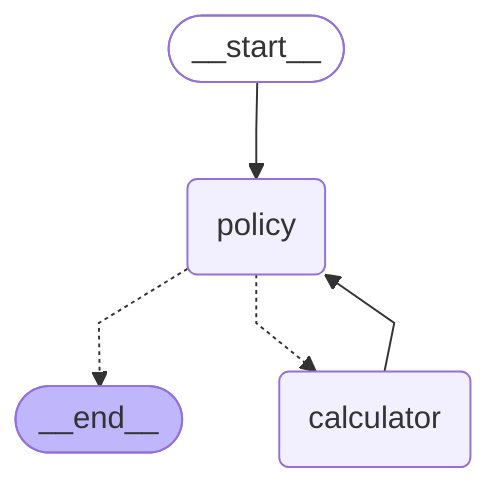

# Simple Tool Agent LangGraph (Mermaid)

This artifact shows how our **simple tool-using agent** looks when rendered as a
graph. Visualizing the flow helps explain the design to people who are less
comfortable reading code but can easily follow a diagram.

The diagram below is generated directly from the LangGraph app using
`app.get_graph().draw_mermaid()`. You can:

- Paste it into a Markdown file (like this one) and view it in a Mermaid-aware
  renderer (GitHub, many IDEs, docs tools).
- Paste it into an online Mermaid editor (e.g. mermaid.live) to tweak the
  layout or export an image.

